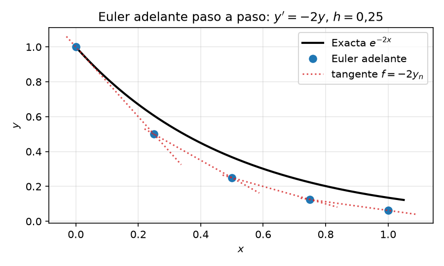
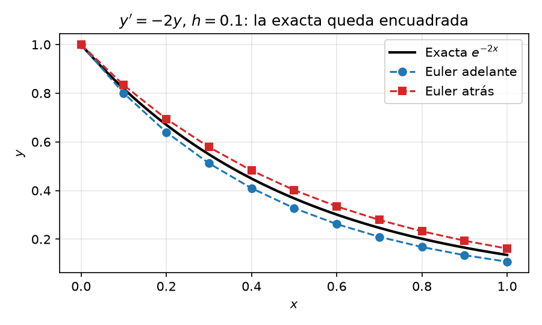

# Problemas de Valor Inicial (PVI)

Un **PVI** proporciona todas las condiciones necesarias en un **único punto inicial** (típicamente $x = a$ o $t = 0$).

* **Intuición** — piensa en lanzar un cohete o una pelota de béisbol. Conoces su posición inicial $y(0)$ y su velocidad inicial $y'(0)$. Una vez lanzado, su trayectoria queda completamente determinada avanzando paso a paso en el tiempo.
* **Forma general (2º orden)**
$$y'' = f(x, y, y'), \quad \text{con } y(a) = \alpha \text{ e } y'(a) = \gamma$$
* **Existencia y unicidad** — si $f$ es continua y localmente Lipschitz respecto de las variables dependientes, el PVI tiene una solución local única.
* **Métodos numéricos** — método de Euler, métodos de Runge–Kutta (RK4). Se parte de $x = a$ y se avanza hasta $x = b$.

---

## Método de Euler hacia adelante
Es el esquema numérico más sencillo para resolver **problemas de valor inicial de primer orden** de la forma
$$\frac{dy}{dx} = f(x, y), \quad y(x_0) = y_0$$
Es un **método explícito de paso único** que estima el siguiente valor $y_{n+1}$ siguiendo la recta tangente (la pendiente) desde el punto conocido $(x_n, y_n)$.

---

### Fórmula básica

La ecuación de actualización es
$$y_{n+1} = y_n + h \cdot f(x_n, y_n)$$
donde
* $x_n$ es el punto actual de la malla, con $x_{n+1} = x_n + h$.
* $h$ es el tamaño de paso ($\Delta x$).
* $f(x_n, y_n)$ es la tasa de cambio (derivada) evaluada al inicio del paso.

---

### Deducción

Desarrollando $y(x)$ en serie de Taylor alrededor de $x_n$
$$y(x_n + h) = y(x_n) + h \cdot y'(x_n) + \frac{h^2}{2!} y''(x_n) + \mathcal{O}(h^3)$$
Truncando los términos de orden $h^2$ y superiores se obtiene la fórmula de Euler hacia adelante. Este método es de **orden 2** en el error local y **orden 1** en el error global, ya que el error se acumula linealmente con el número de pasos.

---

### Ejemplo numérico paso a paso

Nuestro ejemplo guía en este capítulo es
$$y' = -2y, \quad y(0) = 1, \quad h = 0.1$$
La solución exacta es $y(x) = e^{-2x}$, que usaremos para comprobar la precisión.

* **Estado inicial ($n=0$)**
$$x_0 = 0, \quad y_0 = 1$$
* **Paso 1 ($x_1 = 0.1$)**
$$f(x_0, y_0) = -2(1) = -2$$
$$y_1 = y_0 + h \cdot f(x_0, y_0) = 1 + (0.1)(-2) = \mathbf{0.8}$$
* **Paso 2 ($x_2 = 0.2$)**
$$f(x_1, y_1) = -2(0.8) = -1.6$$
$$y_2 = y_1 + h \cdot f(x_1, y_1) = 0.8 + (0.1)(-1.6) = \mathbf{0.64}$$
* **Pasos 3–5** siguen el mismo patrón $y_{n+1} = y_n(1 - 2h) = 0.8\,y_n$

| $n$ | $x_n$ | $y_n$ (Euler adelante) |
| --- | --- | --- |
| 3 | 0.3 | $0.64 \times 0.8 = \mathbf{0.512}$ |
| 4 | 0.4 | $0.512 \times 0.8 = \mathbf{0.4096}$ |
| 5 | 0.5 | $0.4096 \times 0.8 = \mathbf{0.3277}$ |

---

### Propiedades clave y limitaciones

* **Precisión** — error global $\mathcal{O}(h)$, error local $\mathcal{O}(h^2)$. Al dividir $h$ a la mitad, el error global de truncamiento se reduce aproximadamente a la mitad.
* **Naturaleza explícita** — $y_{n+1}$ se calcula directamente a partir de valores conocidos en el paso $n$, sin resolver sistemas lineales ni no lineales.
* **Estabilidad condicional** — para la ecuación de prueba $y' = -\lambda y$, Euler hacia adelante se vuelve inestable y oscila hacia infinito salvo que $h < \frac{2}{\lambda}$ (véase [Estabilidad](03-Estabilidad.md)).

---

## Método de Euler hacia atrás

El **método de Euler hacia atrás** es un **esquema numérico implícito de paso único**. Mientras Euler hacia adelante evalúa la pendiente al *inicio* del paso, Euler hacia atrás la evalúa al **final** ($x_{n+1}$). Se llama «implícito» porque el valor buscado —$y_{n+1}$— aparece dentro de la función en el lado derecho de la ecuación
$$y_{n+1} = y_n + h \cdot f(x_{n+1}, y_{n+1})$$
donde $x_{n+1} = x_n + h$ (con $h$ el tamaño de paso) y $f(x_{n+1}, y_{n+1})$ es la pendiente en el estado final, que aún no conocemos.
No se puede evaluar directamente el lado derecho con aritmética simple, porque $y_{n+1}$ se define a sí mismo, por lo que hay que resolver una ecuación algebraica (o un sistema) en cada paso. A cambio, el método es mucho más estable para problemas rígidos.

---

### Deducción

Desarrollando $y(x_n)$ hacia atrás desde $x_{n+1}$
$$y(x_n) = y(x_{n+1}) - h \cdot y'(x_{n+1}) + \mathcal{O}(h^2)$$
Al despejar $y(x_{n+1})$ se obtiene la fórmula de Euler hacia atrás.

---

### Ejemplo resuelto: Euler hacia atrás sobre $y' = -2y$

Continuamos con el mismo ejemplo guía, $y' = -2y$, $y(0) = 1$, $h = 0.1$.
1. Sustituir en la fórmula
$$y_{n+1} = y_n + 0.1 \cdot (-2 y_{n+1})$$
2. Reordenar algebraicamente para despejar $y_{n+1}$
$$y_{n+1} + 0.2 y_{n+1} = y_n \implies 1.2 y_{n+1} = y_n \implies y_{n+1} = \frac{y_n}{1.2}$$
3. Avanzar paso a paso

| $n$ | $x_n$ | $y_n$ (Euler atrás) |
| --- | --- | --- |
| 1 | 0.1 | $1/1.2 \approx \mathbf{0.8333}$ |
| 2 | 0.2 | $0.8333/1.2 \approx \mathbf{0.6944}$ |
| 3 | 0.3 | $0.6944/1.2 \approx \mathbf{0.5787}$ |
| 4 | 0.4 | $0.5787/1.2 \approx \mathbf{0.4823}$ |

> **La complejidad computacional.** Para una EDO no lineal como $y' = -y^2$, el paso 2 que vimos recién exige resolver $0.1\,y_{n+1}^2 + y_{n+1} - y_n = 0$. En este caso es una cuadrática, pero en general es una ecuación no lineal que requiere algún método de resolición de raíces (p. ej. **Newton–Raphson**) en cada paso. Ese es el coste del esquema implícito, cada paso requiere resolver una ecuación que el método explícito evita.

---

### Propiedades clave y ventajas

* **Estabilidad** — para la ecuación lineal de prueba $y'=\lambda y$ con $\operatorname{Re}(\lambda)<0$, Euler atrás es estable para cualquier $h>0$. Un paso grande puede ser poco preciso aunque permanezca estable.
* **Sistemas rígidos** — ideal para sistemas físicos con escalas temporales muy dispares (p. ej. reacciones químicas rápidas junto a transporte físico lento).
* **Precisión** — error local $\mathcal{O}(h^2)$, error global $\mathcal{O}(h)$ — el mismo orden que Euler hacia adelante. La ventaja de Euler hacia atrás es la **estabilidad**, no la precisión.

---

## Los métodos de Euler como integración numérica

Como $y'=f(x,y)$, en un paso se cumple $y_{n+1}=y_n+\int_{x_n}^{x_{n+1}}f(x,y(x))\,dx$. Euler adelante aproxima la integral con el valor de la pendiente al inicio; Euler atrás, con el valor al final. RK2 estima una pendiente intermedia para cancelar el término principal del error, y RK4 combina cuatro pendientes para alcanzar cuarto orden. Esta interpretación explica el encuadre del ejemplo. Para esta solución decreciente y convexa, Euler adelante subestima y Euler atrás sobreestima. No es una propiedad universal de ambos métodos.

---

### Comparación numérica sobre el ejemplo guía

Ambos métodos aplicados a $y' = -2y$, $y(0) = 1$, $h = 0.1$, con solución exacta $y = e^{-2x}$

| $x_n$ | Euler adelante | Euler atrás | Exacta $e^{-2x}$ | Error adelante | Error atrás |
| --- | --- | --- | --- | --- | --- |
| 0.1 | 0.8000 | 0.8333 | 0.8187 | 0.0187 | 0.0146 |
| 0.2 | 0.6400 | 0.6944 | 0.6703 | 0.0303 | 0.0241 |
| 0.3 | 0.5120 | 0.5787 | 0.5488 | 0.0368 | 0.0299 |
| 0.4 | 0.4096 | 0.4823 | 0.4493 | 0.0397 | 0.0330 |
| 0.5 | 0.3277 | 0.4019 | 0.3679 | 0.0402 | 0.0340 |

En **este ejemplo**, Euler adelante subestima y Euler atrás sobreestima, de modo que la exacta queda entre ambos. Los dos tienen error global $\mathcal{O}(h)$; Euler atrás resulta aquí ligeramente más preciso. Este encuadre depende de la forma de la solución y no vale para toda EDO. La comparación de estabilidad y de coste por paso se desarrolla en [Estabilidad](03-Estabilidad.md).

> **Comprueba tu comprensión.** Si repites la tabla anterior con $h = 0.05$, ¿en qué factor esperas que se reduzcan los errores de ambos métodos? ¿Y con un método de orden 2 como RK2 de [Runge–Kutta](02-RungeKutta.md)?

---

## Sistemas de EDO

Todo lo anterior usa una única ecuación escalar, pero los métodos se generalizan a los casos donde en lugar de una función incógnita hay $m$ funciones acopladas de la misma variable independiente $x$. En este caso tenemos un **sistema** de $m$ EDO de primer orden, y todo lo que hay que hacer es sustituir los escalares por vectores y las ecuaciones por sistemas de ecuaciones.
Los métodos se aplican de forma similar, la única diferencia es que cada evaluación de $f$ devuelve un vector de $m$ componentes en lugar de un escalar, y que en los métodos implícitos la resolución algebraica de cada paso se convierte en un *sistema lineal* o *no lineal* en lugar de una ecuación escalar.

### Reducción de EDO de orden superior a sistemas de primer orden

Toda EDO de orden $n$ puede convertirse en un sistema de $n$ EDO de primer orden introduciendo variables auxiliares para cada derivada
$$y^{(n)} = f(x, y, y', \dots, y^{(n-1)})$$
se convierte, con $u_1 = y,\; u_2 = y',\; \dots,\; u_n = y^{(n-1)}$, en
$$\begin{cases} u_1' = u_2 \\ u_2' = u_3 \\ \vdots \\ u_n' = f(x, u_1, u_2, \dots, u_n) \end{cases}$$
Esta es exactamente la reducción que usa el **método del disparo** en [PVF](05-PVF.md) que veremos más adelante.
Todo integrador de PVI en la práctica (`ode45` de MATLAB, `solve_ivp` de SciPy, etc.) trabaja internamente con sistemas de primer orden, así que esta reducción es el punto de entrada estándar a la resolución numérica de EDO.

### Ejemplo rápido: el oscilador armónico

La EDO de 2º orden $y'' + \omega^2 y = 0$ (movimiento armónico simple) se convierte en un sistema de primer orden llamando $u = y$ a la posición y $v = y'$ a la velocidad
$$u' = v, \qquad v' = -\omega^2 u, \qquad u(0) = y_0, \quad v(0) = v_0$$
Un paso de Euler hacia adelante con $h = 0.1$, $\omega = 1$, $u_0 = 1$, $v_0 = 0$ actualiza cada variable por separado, igual que en el caso escalar
$$u_1 = u_0 + h\,v_0 = 1 + 0.1 \cdot 0 = 1.0, \qquad v_1 = v_0 + h\,(-\omega^2 u_0) = 0 - 0.1 \cdot 1 = -0.1$$
La posición no cambia en el primer paso (la velocidad inicial es nula) y la velocidad se vuelve negativa — el oscilador empieza a descender desde el desplazamiento máximo, como corresponde a la solución exacta $y = \cos x$.

---

## Método de Diferencias Finitas (MDF)

Hasta ahora hemos resuelto EDO de primer orden **marchando** por el dominio, partiendo del valor inicial conocido $y(0) = \alpha$ y avanzando en incrementos de tamaño $h$, calculando cada nuevo valor $y_i$ a partir del anterior $y_{i-1}$ (con los esquemas de Euler hacia adelante o hacia atrás). Este enfoque secuencial funciona porque un problema de valor inicial de primer orden aporta toda la información necesaria en el punto de partida.

El **Método de Diferencias Finitas (MDF)** adopta en cambio una visión global, discretiza *todo* el dominio de una vez y cada punto de la malla se convierte en una incógnita. La derivada en cada punto se reemplaza por una aproximación en diferencias finitas, y todas las ecuaciones algebraicas resultantes se reúnen en un único sistema lineal $A\mathbf{y} = \mathbf{b}$ que se resuelve simultáneamente, en lugar de paso a paso.

Ilustramos el método con el mismo ejemplo guía, ahora resuelto globalmente

$$y' = -2y, \quad y(0) = 1, \quad x \in [0, 1]$$

En este caso sencillo el sistema resultante es triangular inferior — cada ecuación vincula $y_i$ solo con $y_{i-1}$ — de modo que resolverlo colapsa a la misma sustitución progresiva que marchar. La ventaja de la formulación global del MDF se hace evidente en los **problemas de valores de frontera** que veremos más adelante, donde las condiciones se dan en *ambos* extremos y no se puede marchar desde un único punto. En esos casos, plantear y resolver el sistema completo de una vez es lo que hace el problema tratable.

¿Y para qué el MDF, si en un PVI no aporta nada nuevo? Porque habilita esquemas que la marcha no admite. Una diferencia *centrada* es más precisa ($\mathcal{O}(h^2)$) pero necesita el punto futuro, así que no se puede marchar con ella; el MDF sí puede, porque resuelve todos los $y_i$ a la vez. Esa es su razón de ser, y es lo que se aprovecha en los PVF, donde ambos extremos son datos y la diferencia centrada cierra sin problema.

---

### Paso 1: Discretizar el dominio

Dividimos el intervalo $[0, 1]$ en $N = 4$ subintervalos de tamaño $h = 0.25$

* $x_0 = 0.00$ (condición inicial $y_0 = 1$)
* $x_1 = 0.25$ (incógnita $y_1$)
* $x_2 = 0.50$ (incógnita $y_2$)
* $x_3 = 0.75$ (incógnita $y_3$)
* $x_4 = 1.00$ (incógnita $y_4$)

---

### Paso 2: Euler hacia atrás
Para este ejemplo elegimos un método basado en diferencias hacia atrás porque con una diferencia hacia adelante la ecuación del último nodo pediría un valor fuera del dominio ($y_{N+1}$) y el sistema no cerraría. Por eso aquí se usa Euler hacia atrás, que solo involucra valores conocidos o incógnitas del propio sistema.

$$y'(x_i) \approx \frac{y_i - y_{i-1}}{h}$$
Sustituyendo en la EDO $y' = -2y$
$$\frac{y_i - y_{i-1}}{h} = -2y_i \implies -y_{i-1} + (1 + 2h)\,y_i = 0$$

---

### Paso 3: Plantear y resolver el sistema lineal

Aplicamos el esquema discretizado del Paso 2 en cada punto desconocido de la malla $i = 1, 2, \dots, N$. Cada punto aporta una ecuación lineal que vincula $y_i$ con su vecino $y_{i-1}$ (y con el valor inicial conocido $y_0 = 1$), produciendo un sistema lineal $N \times N$, $A\mathbf{y} = \mathbf{b}$. En este caso, el esquema de Euler hacia atrás acopla cada incógnita solo con la anterior, $A$ es triangular inferior y el sistema se resuelve de manera simple.

#### Ejemplo numérico resuelto

Planteemos el sistema del ejemplo guía con el **esquema de Euler hacia atrás** y $h = 0.25$
$$-y_{i-1} + (1 + 2(0.25))y_i = 0 \implies -y_{i-1} + 1.5\,y_i = 0$$
Escribiendo esta ecuación para todos los puntos de la malla $i = 1, 2, 3, 4$ (pasando el valor conocido $y_0 = 1$ al lado derecho)
* **Para $i = 1$ ($x_1 = 0.25$)**
$$-y_0 + 1.5\,y_1 = 0 \implies 1.5\,y_1 = y_0 = 1$$
* **Para $i = 2$ ($x_2 = 0.50$)**
$$-y_1 + 1.5\,y_2 = 0$$
* **Para $i = 3$ ($x_3 = 0.75$)**
$$-y_2 + 1.5\,y_3 = 0$$
* **Para $i = 4$ ($x_4 = 1.00$)**
$$-y_3 + 1.5\,y_4 = 0$$

---

#### Forma matricial y resolución

En forma matricial ($A\mathbf{y} = \mathbf{b}$)
$$\begin{bmatrix} 1.5 & 0 & 0 & 0 \\ -1 & 1.5 & 0 & 0 \\ 0 & -1 & 1.5 & 0 \\ 0 & 0 & -1 & 1.5 \end{bmatrix} \begin{bmatrix} y_1 \\ y_2 \\ y_3 \\ y_4 \end{bmatrix} = \begin{bmatrix} 1 \\ 0 \\ 0 \\ 0 \end{bmatrix}$$

Resolviendo por sustitución progresiva

* $y_1 = \frac{1}{1.5} \approx \mathbf{0.6667}$
* $y_2 = \frac{0.6667}{1.5} \approx \mathbf{0.4444}$
* $y_3 = \frac{0.4444}{1.5} \approx \mathbf{0.2963}$
* $y_4 = \frac{0.2963}{1.5} \approx \mathbf{0.1975}$

---

### Comparación con la solución exacta

La solución exacta es $y(x) = e^{-2x}$.

| $x_i$ | MDF ($y_i$) | Exacta $y(x)$ | Error absoluto |
| --- | --- | --- | --- |
| **0.25** | 0.6667 | 0.6065 | 0.0602 |
| **0.50** | 0.4444 | 0.3679 | 0.0765 |
| **0.75** | 0.2963 | 0.2231 | 0.0732 |
| **1.00** | 0.1975 | 0.1353 | 0.0622 |

*Nota: estos son exactamente los mismos valores que produciría Euler hacia atrás con $h = 0.25$ — el sistema MDF triangular inferior para un PVI de 1er orden es equivalente a marchar con la solución de Euler hacia atrás.*
