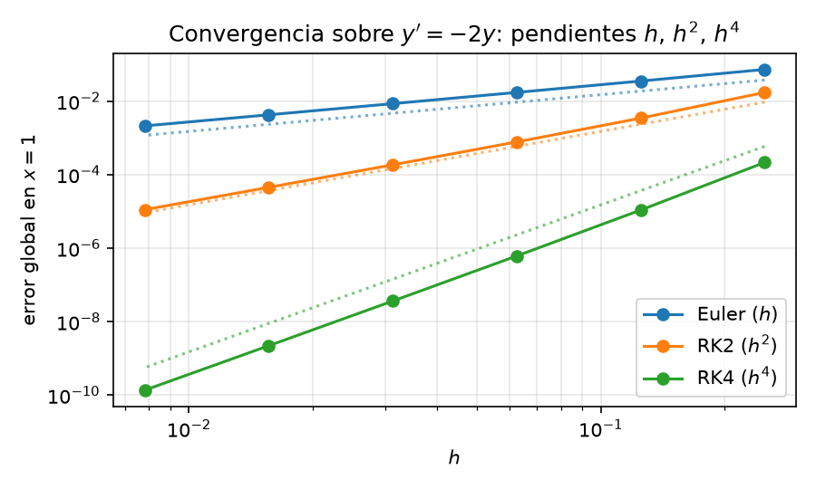

# Métodos de Runge–Kutta

En el capítulo anterior vimos Euler hacia adelante y hacia atrás. Ambos son **métodos de paso único** porque $y_{n+1}$ depende solo de $y_n$. El primero se evalúa directamente y el segundo exige resolver una ecuación implícita. Su bajo orden de precisión motiva métodos más eficientes. Aquí estudiamos una de las familias de integradores de EDO más usadas, los **métodos de Runge–Kutta multi-etapa**.

Los métodos de Runge–Kutta siguen siendo *de paso único* porque $y_{n+1}$ depende solo de $y_n$. Las etapas son internas al paso, los métodos *Multi-paso* se refieren a otra familia, como los métodos de Adams, que reutilizan valores anteriores $y_{n-1}, y_{n-2}, \dots$.

En los métodos RK la idea clave es tomar varias evaluaciones *de prueba* de la pendiente dentro de un mismo paso y combinarlas en una media ponderada, logrando mayor precisión que Euler a costa de más evaluaciones de $f$ por paso.

---

## RK2: el método del punto medio

Consideremos el problema de valor inicial de primer orden

$$\frac{dy}{dx} = f(x, y), \quad y(x_0) = y_0$$

Antes aproximamos la derivada con una diferencia finita evaluada al *inicio* (Euler adelante) o al *final* (Euler atrás) de cada intervalo. Ahora usamos la **diferencia centrada** entre los extremos $x$ y $x + h$, que aproxima la derivada en el **punto medio** $x + h/2$ con error $\mathcal{O}(h^2)$ — la misma aproximación de [PVF](05-PVF.md):

$$\frac{y(x + h) - y(x)}{h} = y'\!\left(x + \tfrac{h}{2}\right) + \mathcal{O}(h^2) = f\!\left(x + \tfrac{h}{2},\; y\!\left(x + \tfrac{h}{2}\right)\right) + \mathcal{O}(h^2)$$

$$\implies y(x + h) = y(x) + h\,f\!\left(x + \tfrac{h}{2},\; y\!\left(x + \tfrac{h}{2}\right)\right) + \mathcal{O}(h^3)$$

La simetría alrededor del punto medio cancela el primer término de error del desarrollo de Taylor — la misma razón por la que la regla de cuadratura del punto medio supera a las de rectángulo izquierdo/derecho (véase [PVI](01-PVI.md)).

El problema es que no conocemos el valor de $y(x + h/2)$. Lo estimamos con un paso intermedio de Euler adelante sobre medio intervalo:

$$y\!\left(x + \tfrac{h}{2}\right) \approx y(x) + \tfrac{h}{2}\,f(x, y(x))$$

Sustituyendo se obtiene el algoritmo de **Runge–Kutta de dos etapas (RK2)**, también llamado *método del punto medio*:

$$y(x + h) \approx y(x) + h\,f\!\left(x + \tfrac{h}{2},\; y(x) + \tfrac{h}{2}\,f(x, y(x))\right)$$

En una malla discreta $x_0, x_1, \dots, x_{N}$ con $y_n \approx y(x_n)$, se escribe de forma compacta usando las **etapas** $k_1, k_2$:

$$y_{n+1} = y_n + h\,k_2$$

donde

$$k_1 = f(x_n, y_n)$$

$$k_2 = f\!\left(x_n + \tfrac{h}{2},\; y_n + \tfrac{h}{2}\,k_1\right)$$

* $k_1$ es la pendiente en el punto actual $(x_n, y_n)$ — la misma que usaría Euler adelante para todo el paso.
* $k_2$ es la pendiente en el punto medio $x + h/2$, obtenida dando un medio paso con $k_1$ y reevaluando $f$ allí.

Geométricamente, se da un medio paso de Euler para llegar al punto medio, se evalúa la pendiente allí y se usa *esa* pendiente para marchar el paso completo desde $x_n$ hasta $x_{n+1}$.

### Ejemplo resuelto: RK2 sobre $y' = -2y$

Continuando con el ejemplo guía de [PVI](01-PVI.md) ($y' = -2y$, $y(0) = 1$, $h = 0.1$, exacta $y = e^{-2x}$), un paso desde $x_0 = 0$:

$$k_1 = f(0, 1) = -2, \qquad y_0 + \tfrac{h}{2}\,k_1 = 1 + \tfrac{0.1}{2}(-2) = 0.9$$

$$k_2 = f(0.05,\; 0.9) = -1.8, \qquad y_1 = 1 + 0.1 \cdot (-1.8) = \mathbf{0.82}$$

El valor exacto es $e^{-0.2} \approx 0.8187$, así que el error es $1.3 \times 10^{-3}$ — un orden de magnitud menor que los $1.9 \times 10^{-2}$ de Euler adelante y los $1.5 \times 10^{-2}$ de Euler atrás (véase la tabla en [PVI](01-PVI.md)).

---

## RK4: Runge–Kutta de cuarto orden

Cuando alguien habla de «el método de Runge–Kutta», casi siempre se refiere al esquema explícito de **cuatro etapas y cuarto orden** (RK4). Su alta precisión (error local $\mathcal{O}(h^5)$) y su buena estabilidad lo convierten en la opción por defecto para problemas de EDO y EDP no rígidos en física e ingeniería.

La actualización RK4 es

$$y_{n+1} = y_n + \frac{h}{6}\left(k_1 + 2k_2 + 2k_3 + k_4\right)$$

donde las cuatro etapas son

$$k_1 = f(x_n,\; y_n)$$

$$k_2 = f\!\left(x_n + \tfrac{h}{2},\; y_n + \tfrac{h}{2}\,k_1\right)$$

$$k_3 = f\!\left(x_n + \tfrac{h}{2},\; y_n + \tfrac{h}{2}\,k_2\right)$$

$$k_4 = f\!\left(x_n + h,\; y_n + h\,k_3\right)$$

Las cuatro etapas corresponden a cuatro estimaciones de la pendiente:

| Etapa | Punto donde se evalúa $f$ | Significado |
| --- | --- | --- |
| $k_1$ | $(x_n,\; y_n)$ | Pendiente al inicio (pendiente de Euler) |
| $k_2$ | $(x_n + h/2,\; y_n + k_1 h/2)$ | Pendiente en el punto medio, usando $k_1$ para llegar |
| $k_3$ | $(x_n + h/2,\; y_n + k_2 h/2)$ | Pendiente en el punto medio, usando $k_2$ para llegar (corregida) |
| $k_4$ | $(x_n + h,\; y_n + k_3 h)$ | Pendiente al final, usando $k_3$ para llegar |

La actualización final es una media ponderada, donde las pendientes intermedias ($k_2,k_3$) pesan el doble que las de los extremos ($k_1,k_4$). Los pesos recuerdan a Simpson, pero los puntos en $y$ se construyen mediante etapas RK y no son los valores exactos de la trayectoria.

### Ejemplo resuelto: RK4 sobre $y' = -2y$

Un paso RK4 desde $x_0 = 0$ sobre el mismo problema:

$$k_1 = f(0, 1) = -2$$

$$k_2 = f(0.05,\; 0.9) = -1.8$$

$$k_3 = f(0.05,\; 0.91) = -1.82$$

$$k_4 = f(0.1,\; 0.818) = -1.636$$

$$y_1 = 1 + \tfrac{0.1}{6}\bigl[-2 + 2(-1.8) + 2(-1.82) + (-1.636)\bigr] = \mathbf{0.8187333}$$

El error es $\approx 2.6 \times 10^{-6}$, unas $500$ veces menor que el de RK2. Sobre el problema modelo, el factor de amplificación de RK4 es $R(z) = 1 + z + z^2/2 + z^3/6 + z^4/24$ con $z = \lambda h$ para la ecuación de prueba $y' = \lambda y$ coincide con el desarrollo de Taylor de $e^{z}$ hasta el orden $z^4$, con un resto $\mathcal{O}(z^5)$ — esta reproducción casi exacta de la exponencial en el primer paso explica los cinco decimales correctos observados.

---

## Métodos implícitos de Runge–Kutta y estabilidad

Tanto RK2 como RK4 son casos de una misma familia. Un método de Runge–Kutta general de $s$ etapas es

$$y_{n+1} = y_n + h\sum_{i=1}^{s} b_i\, k_i, \qquad k_i = f\!\left(x_n + c_i h,\; y_n + h\sum_{j=1}^{s} a_{ij}\, k_j\right)$$

Los coeficientes $a_{ij}$, $b_i$, $c_i$ definen el método; los $a_{ij}$ forman la **matriz de etapas** $A$. RK2 y RK4 son los casos **explícitos**, el los que $A$ es triangular inferior ($a_{ij} = 0$ para $j \ge i$), así que la suma de la definición solo recorre $j < i$ — cada etapa depende de las anteriores y se calcula en secuencia. El Runge–Kutta **implícito** usa una matriz $A$ llena, donde $k_i$ puede depender de sí mismo y de etapas posteriores, de modo que las etapas forman un sistema acoplado de ecuaciones no lineales que debe resolverse simultáneamente en cada paso antes de producir $y_{n+1}$.

Esto encarece mucho cada paso, pero compra dos propiedades cruciales:

* **Estabilidad incondicional (A-estabilidad).** Los métodos RK explícitos heredan la limitación fundamental de Euler adelante. Siempre hay un techo de tamaño de paso más allá del cual la solución diverge. Los métodos implícitos pueden construirse A-estables, lo cual es esencial para EDO **rígidas** (cinética química, combustión, simulación de circuitos, reacción–difusión), donde la tasa de decaimiento más rápida es órdenes de magnitud mayor que la más lenta y haría impracticable el paso de un método explícito.

* **Alta precisión con pasos grandes.** Al no estar el tamaño de paso limitado por la estabilidad, se elige solo por criterios de precisión. En problemas rígidos esto suele suponer muchos menos pasos en total que con un método explícito, por lo que el mayor coste por paso queda sobradamente compensado.

En la práctica la elección depende del problema. **RK4 explícito** para problemas no rígidos, donde la precisión es el cuello de botella y el paso está lejos del límite de estabilidad; **RK implícito** para problemas rígidos, donde la estabilidad forzaría al método explícito a pasos inútilmente pequeños.

---

## Resumen

Para la ecuación de prueba $y' = \lambda y$ con $\operatorname{Re}(\lambda) < 0$:

| Método | Etapas por paso | Error local | Error global | Estabilidad |
| --- | --- | --- | --- | --- |
| Euler adelante | 1 | $\mathcal{O}(h^2)$ | $\mathcal{O}(h)$ | Condicional: $h < 2/|\lambda|$ |
| RK2 (punto medio) | 2 | $\mathcal{O}(h^3)$ | $\mathcal{O}(h^2)$ | Mismo límite en el eje real que Euler ($h < 2/|\lambda|$); región mayor fuera del eje real |
| RK4 | 4 | $\mathcal{O}(h^5)$ | $\mathcal{O}(h^4)$ | Límite mayor en el eje real ($h \lesssim 2.78/|\lambda|$); región mucho mayor fuera del eje |
| RK implícito de Gauss | $s$ (acopladas) | $\mathcal{O}(h^{2s+1})$ | $\mathcal{O}(h^{2s})$ | A-estable; no necesariamente L-estable |

El compromiso es **precisión vs. coste**, cada etapa explícita de Runge–Kutta exige una evaluación de $f$, así que RK4 cuesta cuatro evaluaciones por paso. Pero su paso mucho mayor (a igual precisión) y su mejor estabilidad suelen hacerlo más barato en conjunto que Euler en cualquier problema donde la precisión importe. Para problemas rígidos, los métodos implícitos de Runge–Kutta cambian un coste por paso mucho mayor (una iteración de Newton en cada paso) por la libertad del techo de estabilidad — y ese intercambio es lo que hace los problemas rígidos tratables.

En la práctica, integradores como `ode45` de MATLAB o `RK45` de SciPy usan **pares encajados de órdenes 4 y 5**, el cual es un método de orden 5 corre junto a uno de orden 4, su diferencia estima el error local y el tamaño de paso $h$ se adapta automáticamente para mantener ese error por debajo de una tolerancia. Esto combina la precisión de RK4 con control automático del paso. El integrador da pasos grandes donde la solución es suave y pequeños donde cambia rápidamente.

> **Comprueba tu comprensión.** En el ejemplo de RK4 el error con $h = 0.1$ fue $\approx 2.6 \times 10^{-6}$. Sin rehacer las cuentas, ¿qué orden de magnitud de error esperarías con $h = 0.05$? ¿Y con $h = 0.2$?
