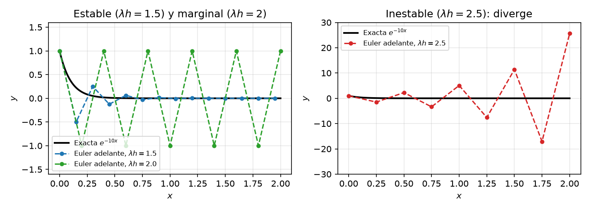

# Análisis de Estabilidad de los Métodos de Euler

Un esquema numérico es **estable** si las pequeñas perturbaciones (redondeo, errores en los datos) no se amplifican sin límite a medida que avanza el cálculo. En Euler hacia adelante la estabilidad depende del **tamaño de paso** $h$ en relación con la dinámica de la EDO. Si $h$ es demasiado grande, la solución numérica puede oscilar y diverger aunque la exacta decaiga a cero.

---

## Problema modelo

$$y' = -\lambda y, \quad \lambda > 0, \quad y(0) = y_0$$

con solución exacta $y(x) = y_0\, e^{-\lambda x}$, que decae monótonamente a $0$.

---

## Euler hacia adelante (explícito)

Sustituyendo $f = -\lambda y$ en la actualización $y_{n+1} = y_n + h\,f(x_n, y_n)$:

$$y_{n+1} = y_n + h(-\lambda\,y_n) = y_n(1 - \lambda h)$$

La recurrencia es geométrica, de factor $1 - \lambda h$:

$$y_n = y_0\,(1 - \lambda h)^n$$

### Condición de estabilidad

La solución exacta tiende a $0$, así que exigimos lo mismo a la numérica, es decir, $\lim_{n \to \infty} y_n = 0$. Una sucesión geométrica $a^n$ tiende a $0$ si y solo si $|a| < 1$:

$$|1 - \lambda h| < 1 \iff -1 < 1 - \lambda h < 1 \iff 0 < \lambda h < 2$$

La cota inferior es automática ($\lambda > 0$, $h > 0$); la superior da la **condición de estabilidad**:

$$\boxed{h < \frac{2}{\lambda}}$$

### Interpretación

| Régimen | Factor de amplificación | Comportamiento de $y_n$ |
| --- | --- | --- |
| $0 < \lambda h \le 1$ | $0 \le 1 - \lambda h < 1$ | Decae monótonamente a $0$ (en $\lambda h = 1$ llega en un paso) |
| $1 < \lambda h < 2$ | $-1 < 1 - \lambda h < 0$ | Decae a $0$ pero **oscila** de signo en cada paso |
| $\lambda h = 2$ | $-1$ | Oscila con amplitud constante (marginal) |
| $\lambda h > 2$ | $|1 - \lambda h| > 1$ | **Inestable**: oscila y crece, $y_n \to \infty$ |

Si $h > 2/\lambda$ la solución numérica diverge aunque la verdadera decaiga — un artefacto de la discretización, no de la física de la EDO.

---

## Euler hacia atrás (implícito)

Euler hacia atrás evalúa la pendiente en el punto *siguiente*: $y_{n+1} = y_n + h\,f(x_{n+1}, y_{n+1})$. Con $f = -\lambda y$, el valor buscado $y_{n+1}$ aparece en ambos lados; despejando:

$$y_{n+1} + \lambda h\,y_{n+1} = y_n \implies y_{n+1}(1 + \lambda h) = y_n$$

De nuevo una recurrencia geométrica:

$$y_n = \frac{y_0}{(1 + \lambda h)^n}$$

### Condición de estabilidad

Como $\lambda h > 0$,

$$0 < \frac{1}{1 + \lambda h} < 1$$

para **todo** paso positivo, y por tanto $y_n \to 0$ siempre. Euler hacia atrás es **incondicionalmente estable**. Esto no significa que un paso grande sea preciso; solo que no produce crecimiento espurio.

---

## Región de estabilidad absoluta

Este análisis es el de la **estabilidad absoluta**, donde los valores de $\lambda h$ para los que una perturbación no crece forman la **región de estabilidad** del método. En el eje real, con la convención de este capítulo ($y' = -\lambda y$, $\lambda > 0$):

| Método | Intervalo estable |
| --- | --- |
| Euler adelante | $0 < \lambda h < 2$ |
| Euler atrás | todo $\lambda h > 0$ |
| RK4 | $\lambda h \lesssim 2.78$ |

Con la convención $y' = \lambda y$ con $\operatorname{Re}\lambda < 0$ —la de [Runge–Kutta](02-RungeKutta.md)— estos intervalos se leen $-2 < h\lambda < 0$, $h\lambda < 0$ y $-2.78 \lesssim h\lambda < 0$. Euler atrás cubre todo el semiplano izquierdo (es **A-estable**). La misma noción reaparece como la condición $r \le \tfrac{1}{2}$ de FTCS en [Parabólicas](09-Parabolicas.md).

---

## Comparación de ambos métodos

| Propiedad | Euler adelante (explícito) | Euler atrás (implícito) |
| --- | --- | --- |
| Actualización | $y_{n+1} = y_n + h\,f(x_n, y_n)$ | $y_{n+1} = y_n + h\,f(x_{n+1}, y_{n+1})$ |
| Factor de amplificación | $1 - \lambda h$ | $\dfrac{1}{1 + \lambda h}$ |
| Estabilidad | Condicional: $h < \dfrac{2}{\lambda}$ | Incondicional |
| Coste por paso | Bajo: una evaluación de $f$ | Mayor: resolver una ecuación para $y_{n+1}$ |
| Con $h$ grande | Oscila y diverge | Decae monótonamente (quizá demasiado rápido) |

El compromiso es **estabilidad vs. coste**. Euler hacia atrás no tiene techo de paso, pero cada paso exige resolver una ecuación (o un sistema). Euler adelante se evalúa directamente, a cambio de limitar $h$.

---

## Ecuaciones rígidas

Un sistema de EDO es **rígido** (*stiff*) cuando conviven dinámicas en escalas temporales muy separadas. Conviven los modos rápidos que decaen en seguida y los modos lentos que gobiernan el largo plazo. Un integrador explícito se ve obligado a dar pasos diminutos solo para mantener estables los modos rápidos, mucho después de que estos hayan desaparecido.

### Un ejemplo canónico: reacciones consecutivas

La cadena de reacciones de primer orden $y_1 \xrightarrow{k_1} y_2 \xrightarrow{k_2} y_3$ con $k_1 = 100 \gg k_2 = 1$ es el modelo más simple con dos escalas. El reactivo $y_1$ se consume en $\sim 10^{-2}$ y el intermediario $y_2$ se acumula de forma transiente para luego decaer en escala $\sim 1$. Las velocidades con las que cambian las concentraciones $y_1$ e $y_2$ son:

$$y_1' = -100\,y_1, \qquad y_2' = 100\,y_1 - y_2, \qquad y_1(0) = 1, \quad y_2(0) = 0$$

La solución exacta de estas ecuaciones es $y_1(x) = e^{-100x}$ e $y_2(x) = \frac{100}{99}\left(e^{-x} - e^{-100x}\right)$. La concentración $y_2$ es **una sola función que contiene los dos modos** que sube rápidamente hasta $\approx 0.95$ en $x \approx 0.05$ y después decae lentamente como $e^{-x}$.

### Por qué los métodos explícitos fracasan aquí

Euler adelante aplicado al sistema da

$$y_{1,n+1} = (1 - 100h)\,y_{1,n}, \qquad y_{2,n+1} = (1 - h)\,y_{2,n} + 100h\,y_{1,n}$$

La primera recurrencia es la escalar ya estudiada y es estable solo si $|1 - 100h| < 1$, es decir $h < 0.02$. Y si ese factor supera 1 en módulo, la explosión no se queda en $y_1$, el término $100h\,y_{1,n}$ de la segunda ecuación la inyecta en $y_2$. La regla general es que en un sistema la condición de estabilidad debe cumplirla **cada modo presente**, así que la estabilidad la dicta el modo más rápido $h < 2\times 10^{-2}$, esto es, $\sim 50$ pasos para llegar a $x = 1$ y $\sim 500$ para $x = 10$.

La precisión en $y_2$ pediría $h \approx 0.02$ (error del $\sim 1\%$), lo que es apenas el techo de estabilidad, y con un $k_1$ mayor el techo caería muy por debajo de lo útil. El tamaño de paso lo fija la **estabilidad**, no la **precisión**.

### Por qué ganan los métodos implícitos

Euler hacia atrás da

$$y_{1,n+1} = \frac{y_{1,n}}{1 + 100h}, \qquad y_{2,n+1} = \frac{y_{2,n} + 100h\,y_{1,n+1}}{1 + h}$$

con factores $1/(1+100h)$ y $1/(1+h)$, ambos menores que $1$ para cualquier $h > 0$. No hay techo de estabilidad, así que el paso se elige solo por criterios de **precisión**. Con $h = 0.1$ —cinco veces el límite de adelante— $y_1$ muere en un paso y $y_2$ sigue a la exacta con un error de unos pocos % en solo 10 pasos. El coste extra de despejar las ecuaciones implícitas (aquí trivial, primero $y_{1,n+1}$, luego $y_{2,n+1}$ por sustitución) queda muy compensado por la reducción del número de pasos.

### Conclusión práctica

| Régimen | Integrador recomendado | Por qué |
| --- | --- | --- |
| No rígido, suave | RK explícito (p. ej. RK45) | Barato por paso, sin resolución de ecuaciones |
| Rígido | Métodos implícitos (Euler atrás, RK implícitos, BDF) | Sin techo de estabilidad; el paso lo fija la precisión |

La pregunta diagnóstica es simple: *¿el tamaño de paso lo fija la precisión o la estabilidad?* Si se necesita un paso diminuto solo para evitar que un modo rápido ya extinguido diverja, el problema es rígido y un método implícito se amortiza con creces.

> **Comprueba tu comprensión.** Para $y' = -50y$, ¿a partir de qué valor de $h$ se vuelve inestable Euler adelante? ¿Qué le ocurre a la solución numérica con $h = 0.05$: diverge, decae monótonamente o decae oscilando?
