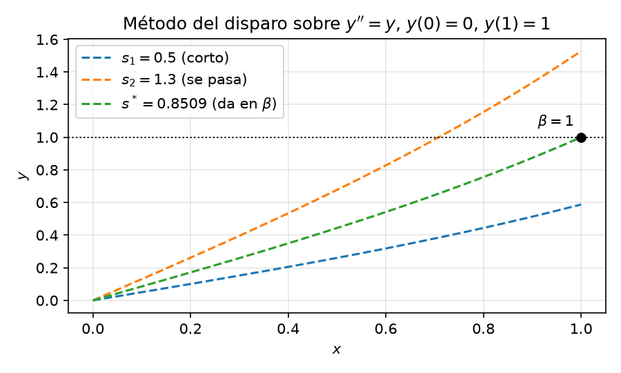

# Problemas de Valores de Frontera

Un **Problema de Valores de Frontera (PVF)** proporciona condiciones en **dos o más puntos distintos** (típicamente los extremos del dominio, $x = a$ y $x = b$). La comparación general PVI vs. PVF está en [Condiciones de contorno](04-CondicionesContorno.md).

* **Intuición:** piensa en la distribución de temperatura a lo largo de una barra metálica. Conoces la temperatura en el extremo izquierdo $y(a)$ y en el derecho $y(b)$, y debes encontrar una distribución que conecte ambos extremos fijados.

* **Forma general (2º orden):**
$$y'' = f(x, y, y'), \quad \text{con } y(a) = \alpha \text{ e } y(b) = \beta$$

---

## Por qué los PVF son difíciles

En un PVI todas las condiciones se dan en el *mismo* punto inicial $x = a$ — se conoce tanto $y(a)$ como $y'(a)$, así que se puede empezar a marchar de inmediato. Un PVF reparte esa información entre dos extremos, se conoce $y(a) = \alpha$ a la izquierda, pero la pendiente $y'(a)$ es **desconocida**. Sin la pendiente no se puede iniciar una integración hacia adelante — y aunque se adivinara una, no se sabría si la adivinanza era correcta hasta llegar al extremo lejano $x = b$ y comprobarla contra $\beta$.

Este es el obstáculo fundamental ya que **la información necesaria para empezar a marchar está repartida por el dominio** en los PVF, de modo que ningún pase hacia adelante puede resolver el problema directamente. Las dos estrategias numéricas de este capítulo son sendas respuestas a ese obstáculo:

* **Disparo** — adivinar la pendiente desconocida, marchar, comprobar el borde lejano y refinar la adivinanza iterativamente.
* **Diferencias Finitas (MDF)** — abandonar la marcha por completo; discretizar todo el dominio de una vez y resolver un sistema lineal acoplado para todos los puntos simultáneamente.

Llevaremos un único ejemplo guía a través de ambos métodos para poder compararlos directamente.

---

## Ejemplo guía

A lo largo de este capítulo resolvemos el PVF lineal

$$y'' = y, \quad y(0) = 0, \quad y(1) = 1$$

La solución exacta es $y(x) = \dfrac{\sinh(x)}{\sinh(1)}$, que usaremos para comprobar los resultados numéricos.

---

## Existencia y unicidad

Los PVF son mucho más delicados que los PVI, ya que un PVF puede tener solución única, infinitas soluciones o **ninguna solución**.

* *Ejemplo con infinitas soluciones:* $y'' + y = 0$ con $y(0) = 0, y(\pi) = 0 \implies y(x) = C \sin(x)$ para cualquier constante $C$.
* *Ejemplo sin solución:* $y'' + y = 0$ con $y(0) = 0, y(\pi) = 1$ (imposible porque $\sin(\pi) = 0 \neq 1$).

**Teorema (PVF lineal).** Para el PVF lineal $y'' + p(x)y' + q(x)y = r(x)$ con condiciones de Dirichlet $y(a) = \alpha$, $y(b) = \beta$, existe solución única **si y solo si** el PVF homogéneo correspondiente ($r = 0$, $\alpha = \beta = 0$) tiene solo la solución trivial $y \equiv 0$.

Una **condición suficiente** sencilla es $q(x) \leq 0$ en $[a, b]$ (por el principio del máximo una solución no trivial tendría un máximo o mínimo interior, lo cual es imposible). Nuestro ejemplo guía la cumple, ya que $q(x) = -1 < 0$.

---

## El método del disparo

El **método del disparo** convierte un PVF en una secuencia de PVI. Como conocemos $y(a)=\alpha$ pero no la pendiente $y'(a)$, *adivinamos* una pendiente, integramos el PVI resultante hasta $x=b$ y comparamos el valor calculado $y(b)$ con el requerido $\beta$. La discrepancia alimenta un bucle de búsqueda de raíces que refina la adivinanza hasta satisfacer la condición en el borde lejano.

El nombre viene de la artillería, en donde se apunta el cañón, se dispara (integrar hacia adelante), se observa dónde cae el proyectil respecto al objetivo, se corrige el ángulo y se dispara de nuevo hasta dar en el blanco.

---

### Mecanismo paso a paso

Consideremos un problema de valores de frontera de segundo orden:

$$y'' = f(x, y, y'), \quad y(a) = \alpha, \quad y(b) = \beta$$

1. **Convertir en un sistema de ecuaciones de primer orden:**
Introducimos $u_1 = y$ y $u_2 = y'$. La EDO de segundo orden se convierte en:

$$\begin{cases} u_1' = u_2 \\ u_2' = f(x, u_1, u_2) \end{cases}$$

2. **Formular como Problema de Valor Inicial (PVI):**
Conocemos $u_1(a) = \alpha$, pero la derivada $u_2(a) = y'(a)$ es desconocida. Ponemos $u_2(a) = s$, donde $s$ es un parámetro de pendiente desconocido (adivinanza).
3. **Resolver el PVI numéricamente:**
Con un integrador estándar (como Runge–Kutta de 4º orden), integramos desde $x = a$ hasta $x = b$ con condiciones iniciales $(u_1(a), u_2(a)) = (\alpha, s)$. Esto da un valor de la solución en el borde lejano, denotado $u_1(b; s)$.
4. **Definir la función residual:**
Definimos una función de error en el borde $F(s)$:
$$F(s) = u_1(b; s) - \beta$$
El objetivo es encontrar un parámetro $s^*$ tal que $F(s^*) = 0$.

5. **Actualizar la adivinanza $s$:**
El paso clave del método es encontrar la raíz $s^*$ de la ecuación
$$F(s^*) = 0, \qquad F(s) := y(b; s) - \beta,$$
es decir, el valor de la pendiente inicial que hace que la solución del PVI llegue justo a la condición de frontera en $x = b$. Como cada evaluación de $F$ cuesta un disparo (integrar el PVI completo de $a$ a $b$), conviene elegir un método de búsqueda de raíces que no desperdicie evaluaciones. Aquí se puede usar el método de la bisección, de la secante o de Newton–Raphson. Si la EDO es lineal, $F(s)$ es una recta y la **secante** converge en un solo paso (es interpolación lineal entre dos puntos); Newton–Raphson también, pero a mayor costo por iteración porque requiere $\partial F/\partial s$. La bisección, en cambio, sigue necesitando varias iteraciones.

---

### Ejemplo resuelto: disparo sobre $y'' = y$

Aplicamos el método del disparo a nuestro ejemplo guía $y'' = y$, $y(0) = 0$, $y(1) = 1$. Cada disparo será una integración con Euler adelante de paso $h = 0.5$, grosero a propósito para poder hacer toda la cuenta a mano.

**Pasos 1–2: el PVI parametrizado.** Con $u_1 = y$, $u_2 = y'$:

$$u_1' = u_2, \quad u_2' = u_1, \quad u_1(0) = 0, \quad u_2(0) = s$$

**Pasos 3–4: un disparo = dos pasos de Euler.** Cada paso actualiza cada componente como $u_{n+1} = u_n + h\,u'_n$; para este sistema $u_1' = u_2$ y $u_2' = u_1$. Aplicado a dos adivinanzas de ejemplo:

:::: {.columns}
::: {.column}
Disparo 1, $s_1 = 0.5$:

| $x$ | $u_1$ | $u_2$ |
| --- | --- | --- |
| $0$ | $0$ | $0.5$ |
| $0.5$ | $0.25$ | $0.5$ |
| $1$ | $0.5$ | $0.625$ |
:::
::: {.column}
Disparo 2, $s_2 = 1.3$:

| $x$ | $u_1$ | $u_2$ |
| --- | --- | --- |
| $0$ | $0$ | $1.3$ |
| $0.5$ | $0.65$ | $1.3$ |
| $1$ | $1.3$ | $1.625$ |
:::
::::

En ambos casos el valor final de $u_1$ coincide con la pendiente elegida, es decir, $y(1; s) \approx s$ para cualquier $s$. El residuo discretizado es entonces $F(s) = s - 1$, una recta, como corresponde a una EDO lineal.

**Paso 5: dos disparos y un paso de secante.** Las dos tablas de arriba son los disparos con adivinanzas $s_1 = 0.5$ y $s_2 = 1.3$. Podemos resumirlas en:

| Disparo | $s$ | $y(1; s)$ (Euler) | $F(s)$ |
| --- | --- | --- | --- |
| 1 | $s_1 = 0.5$ | $0.5$ (se queda corto) | $-0.5$ |
| 2 | $s_2 = 1.3$ | $1.3$ (se pasa) | $+0.3$ |

Un paso de secante entre $(s_1, F_1) = (0.5, -0.5)$ y $(s_2, F_2) = (1.3, 0.3)$:

$$s_3 = s_1 - F(s_1)\,\frac{s_2 - s_1}{F(s_2) - F(s_1)} = 0.5 - (-0.5)\,\frac{1.3 - 0.5}{0.3 - (-0.5)} = 0.5 + 0.5\,\frac{0.8}{0.8} = \mathbf{1.0}$$

Como $F$ es una recta, ese único paso da la raíz exacta del residuo discretizado.

**Disparo de confirmación.** Integrando con $s = 1$ da $(0, 1) \to (0.5,\ 0.5) \to (1,\ 1)$ — llega exactamente a $\beta$. $\checkmark$

**El precio del paso $h$ grande.** La secante encontró $s = 1$, la raíz exacta del residuo *discretizado* — es decir, del residuo tal como lo calcula Euler con $h = 0.5$. La pendiente verdadera, sin embargo, es $s^* = 1/\sinh(1) \approx 0.851$ — la que aparecía en la figura conceptual del método, donde los disparos se integran de forma exacta. La diferencia de $\approx 0.15$ es enteramente error del integrador. El método del disparo halla la raíz del residuo *que el integrador calcula*, no del residuo exacto, y al refinar $h$ (o usar un integrador más preciso como RK4) la raíz numérica converge al valor real.

> **Comprueba tu comprensión.** Si dos disparos dan $F(s_1) = 0.3$ en $s_1 = 1$ y $F(s_2) = -0.1$ en $s_2 = 2$, ¿cuál es el $s^*$ interpolado?

---

## Método de Diferencias Finitas (MDF) para problemas de valores de frontera

Igual que en los problemas de valor inicial, podemos usar el método de diferencias finitas (MDF) en los problemas de valores de frontera. El **MDF** resuelve EDO reemplazando las derivadas continuas por aproximaciones algebraicas en los puntos de una malla. En lugar de integrar una función hacia adelante como el método del disparo, el MDF plantea un sistema de ecuaciones lineales en todo el dominio y resuelve simultáneamente todos los valores desconocidos.

---

### Paso 1: Discretizar el dominio

Dividimos el intervalo $[a, b]$ en $N$ subintervalos iguales de tamaño $h = \frac{b - a}{N}$.

Esto crea $N + 1$ puntos de malla:

$$x_i = a + i \cdot h \quad \text{para } i = 0, 1, 2, \dots, N$$

La solución exacta $y(x_i)$ en el punto $x_i$ se aproxima por un valor discreto $y_i$.

---

### Paso 2: Reemplazar las derivadas por fórmulas en diferencias

Usando desarrollos de Taylor alrededor de $x_i$, las derivadas se reemplazan por diferencias finitas:

* **Primera derivada (diferencia centrada, precisión $\mathcal{O}(h^2)$):**

$$y'(x_i) \approx \frac{y_{i+1} - y_{i-1}}{2h}$$

* **Segunda derivada (diferencia centrada, precisión $\mathcal{O}(h^2)$):**

$$y''(x_i) \approx \frac{y_{i+1} - 2y_i + y_{i-1}}{h^2}$$

---

### Paso 3: Plantear y resolver el sistema lineal

Aplicamos el esquema discretizado en cada punto interior de la malla $i = 1, 2, \dots, N-1$. Cada punto aporta una ecuación lineal que vincula $y_{i-1}$, $y_i$ e $y_{i+1}$, produciendo un sistema lineal $(N-1) \times (N-1)$, $A\mathbf{y} = \mathbf{b}$. Como el stencil centrado acopla cada incógnita solo con sus dos vecinas más próximas, $A$ es **tridiagonal** y el sistema se resuelve eficientemente con el algoritmo de Thomas, de coste $\mathcal{O}(N)$.

---

#### Ejemplo resuelto: MDF sobre $y'' = y$

Aplicamos el MDF a nuestro ejemplo guía $y'' = y$, $y(0) = 0$, $y(1) = 1$ con $N = 4$, $h = 0.25$.

**Sustituir las diferencias finitas.** Reemplazando $y''$ por la diferencia centrada e $y$ por $y_i$:

$$\frac{y_{i+1} - 2y_i + y_{i-1}}{h^2} = y_i \implies y_{i-1} - (2 + h^2)\,y_i + y_{i+1} = 0$$

Con $h = 0.25$, $h^2 = 0.0625$, así que $2 + h^2 = 2.0625$:

$$y_{i-1} - 2.0625\,y_i + y_{i+1} = 0$$

**Escribir las ecuaciones en cada nodo interior** ($i = 1, 2, 3$), sustituyendo los valores de contorno conocidos $y_0 = 0$ e $y_4 = 1$:

* $i = 1$: $\quad y_0 - 2.0625\,y_1 + y_2 = 0 \implies -2.0625\,y_1 + y_2 + 0\,y_3= 0$
* $i = 2$: $\quad y_1 - 2.0625\,y_2 + y_3 = 0 \implies y_1 - 2.0625\,y_2 + y_3 = 0$
* $i = 3$: $\quad y_2 - 2.0625\,y_3 + y_4 = 0 \implies 0\,y_1 + y_2 - 2.0625\,y_3 = -1$

**Ensamblar el sistema tridiagonal** $A\mathbf{y} = \mathbf{b}$. Los valores de contorno $y_0 = 0$ e $y_4 = 1$ son *conocidos*, así que no aparecen como incógnitas; en su lugar $y_4 = 1$ pasa al lado derecho de la última ecuación:

$$\begin{bmatrix} -2.0625 & 1 & 0 \\ 1 & -2.0625 & 1 \\ 0 & 1 & -2.0625 \end{bmatrix} \begin{bmatrix} y_1 \\ y_2 \\ y_3 \end{bmatrix} = \begin{bmatrix} 0 \\ 0 \\ -1 \end{bmatrix}$$

Resolviendo por sustitución progresiva obtenemos $y_1 \approx 0.2151$, $y_2 \approx 0.4437$ e $y_3 \approx 0.7000$.

**Comparar con la solución exacta** $y(x) = \sinh(x)/\sinh(1)$:

| $x_i$ | MDF ($y_i$) | Exacta $y(x_i)$ | Error absoluto |
| --- | --- | --- | --- |
| 0.25 | 0.2151 | 0.2150 | 0.0002 |
| 0.50 | 0.4437 | 0.4434 | 0.0003 |
| 0.75 | 0.7000 | 0.6997 | 0.0002 |

Los errores son del orden de $10^{-4}$, coherentes con la precisión $\mathcal{O}(h^2)$ del esquema centrado.

---

### Tratamiento de distintas condiciones de contorno en la matriz

El ejemplo resuelto anterior usa condiciones de **Dirichlet** ($y_0 = \alpha$, $y_N = \beta$). Los valores de contorno son conocidos, así que pasan al vector del lado derecho $\mathbf{b}$ y no aparecen como incógnitas. La primera y la última fila de $A$ contienen entonces solo los acoplamientos interiores.

Las condiciones de **Neumann** ($y'(a) = \alpha'$ o $y'(b) = \beta'$) requieren un tratamiento distinto porque el *valor* en el borde pasa a ser desconocido. El enfoque estándar usa un **punto fantasma** — un punto de malla ficticio $y_{-1}$ justo fuera del dominio — para mantener la precisión $\mathcal{O}(h^2)$:

1. Aproximar la derivada en $x_0$ con una diferencia centrada, $y'(x_0) \approx \frac{y_1 - y_{-1}}{2h} = \alpha'$, lo que da $y_{-1} = y_1 - 2h\,\alpha'$.
2. Aplicar la EDO en $x_0$ (ahora una incógnita) y sustituir la expresión del punto fantasma para eliminar $y_{-1}$.

Esto añade $y_0$ como incógnita (la matriz crece en una fila y una columna) y modifica la primera fila para incorporar la condición de Neumann. Una alternativa más sencilla pero de menor orden es la diferencia unilateral $y'(x_0) \approx \frac{y_1 - y_0}{h} = \alpha'$, que da $y_0 = y_1 - h\,\alpha'$ directamente pero reduce la precisión en el borde a $\mathcal{O}(h)$.

Las condiciones de **Robin** ($c_1\,y(a) + c_2\,y'(a) = \gamma$) combinan ambas — se usa la diferencia centrada con punto fantasma para $y'(a)$, se sustituye en la ecuación de Robin para eliminar $y_{-1}$ y se procede como en el caso de Neumann.

---

### Precisión y análisis del error

Las aproximaciones en diferencias centradas para $y'$ e $y''$ tienen ambas **error local de truncamiento** $\mathcal{O}(h^2)$. Al ensamblarlas en el sistema lineal completo de un PVF bien condicionado, el **error global** — la diferencia entre las soluciones numérica y exacta en cada punto de la malla — también es $\mathcal{O}(h^2)$.

Esto significa que **dividir el paso $h$ a la mitad divide el error entre cuatro** (el error escala como $h^2$). Esta escala sirve como comprobación práctica de convergencia y resuelve el PVF con $N$ y $2N$ puntos. Si el error cae en un factor aproximado de 4, el esquema se comporta como predice la teoría. Si cae solo en un factor 2, puede estar dominando un tratamiento de borde de orden menor (p. ej. diferencias unilaterales en una condición de Neumann).

En nuestro ejemplo guía con $h = 0.25$, el error máximo fue $\approx 0.0003$. Al refinar a $h = 0.125$ ($N = 8$) se reduciría a $\approx 0.00008$.

> **Comprueba tu comprensión.** Si duplicas $N$ (divides $h$ a la mitad) en el esquema MDF anterior, ¿en qué factor debería decrecer el error máximo? Si el error en $N = 4$ es $3 \times 10^{-4}$, ¿qué error esperas en $N = 8$?

---

## Comparación: disparo vs. MDF

| Propiedad | Método del disparo | Método de Diferencias Finitas (MDF) |
| --- | --- | --- |
| **Idea central** | Convertir el PVF en PVI; buscar la raíz para la pendiente desconocida | Discretizar todo el dominio; resolver un sistema lineal acoplado |
| **Incógnitas** | Un escalar $s$ (la pendiente desconocida) | Todos los $y_i$ interiores simultáneamente |
| **Iteraciones** | 2 integraciones de PVI (lineal) o más (no lineal) | 1 resolución (lineal) o iteraciones de Newton (no lineal) |
| **Precisión** | Hereda el orden del integrador PVI (p. ej. RK4 = $\mathcal{O}(h^4)$) | $\mathcal{O}(h^2)$ con diferencias centradas |
| **Condicionamiento** | Puede amplificar errores al marchar hasta $b$ | Depende del condicionamiento del sistema discreto |
| **Coste por paso** | Bajo — reutiliza un integrador PVI existente | Construir + resolver sistema tridiagonal ($\mathcal{O}(N)$, Thomas) |
| **EDO no lineales** | Búsqueda de raíz en $F(s)$ (problema 1D) | Iteración de Newton sobre el sistema completo (multidimensional) |
| **Extensión a EDP** | No natural | Natural (se extiende a mallas 2D/3D) |
| **Mejor para** | PVF suaves cuando ya se dispone de un buen integrador PVI | Geometrías discretizables y extensión natural a EDP |

---

### Ventajas y desventajas

**Método del disparo:**
* **Ventajas:** reutiliza integradores PVI bien probados y hereda su orden; para una EDO escalar de segundo orden, la búsqueda de raíces es unidimensional.
* **Desventajas:** puede ser inestable en problemas rígidos (el integrador del PVI puede divergir antes de llegar a $x = b$); sensible a la adivinanza inicial en problemas no lineales.

**Método de Diferencias Finitas:**
* **Ventajas:** en problemas lineales requiere una sola resolución; trata todos los nodos simultáneamente y se extiende de forma natural a EDP.
* **Desventajas:** construir las ecuaciones matriciales de EDO no lineales exige solucionadores iterativos como Newton–Raphson; el tamaño de malla $h$ debe ser suficientemente pequeño para la precisión deseada; menos preciso por grado de libertad que los métodos PVI de alto orden.
