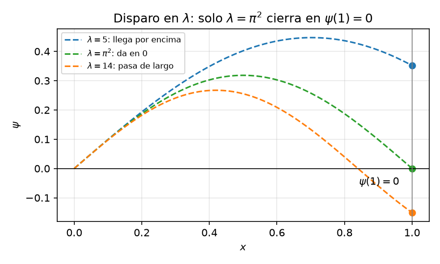
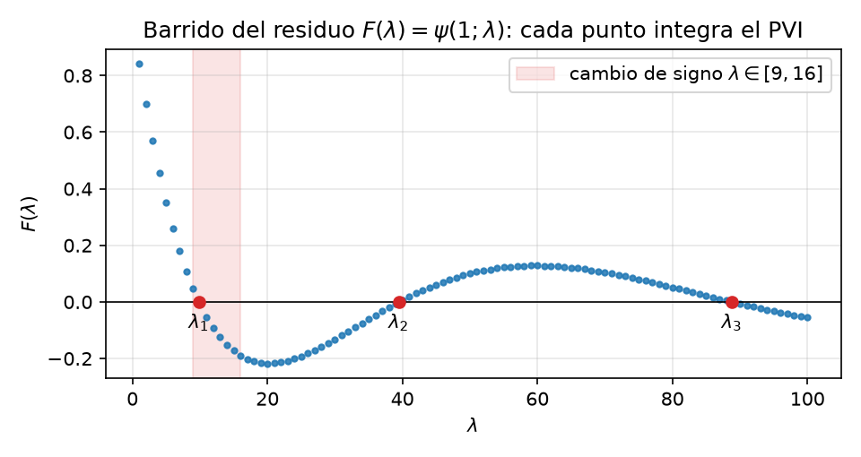

# El método del disparo para problemas de autovalores

En el [PVF](05-PVF.md) las condiciones fijaban valores concretos en los bordes ($y(a)=\alpha$, $y(b)=\beta$) y quedaba una sola solución, que el disparo hallaba ajustando la pendiente $s$. Un **problema de autovalores** cambia las reglas en dos aspectos: la EDO trae un parámetro libre $\lambda$, y las condiciones de borde son **homogéneas**, es decir, piden que la solución valga cero en los extremos, sin fijar ningún valor ($\gamma=0$; véase [condiciones de contorno](04-CondicionesContorno.md)). Por ejemplo,

$$y'' + \lambda y = 0, \qquad y(a)=y(b)=0.$$

La función $y\equiv0$ satisface el problema para cualquier $\lambda$. La pregunta útil es otra: **¿para qué valores de $\lambda$ existe una solución no nula?** Esos valores son los **autovalores** y las soluciones asociadas, las **autofunciones**.

¿Por qué aparecen valores *aislados* y no un continuo? Piensa en una cuerda de guitarra clavada en sus dos extremos. $\lambda$ fija la longitud de onda con que oscila (más $\lambda$, ondas más cortas). La cuerda vibra libremente, pero los dos clavos la fijan y la obligan a valer cero justo en $x=a$ y en $x=b$. Para casi cualquier $\lambda$ la onda llega al segundo clavo a media altura y no se puede sujetar. Solo encajan las longitudes de onda en las que cabe **un número entero de semiondas** entre los extremos. Estos son el modo fundamental (media onda), el siguiente (una onda entera), y así sucesivamente. Esos pocos $\lambda$ que «afinan» son los autovalores. Esta es la misma razón por la que una cuerda suena en armónicos y no en cualquier tono.

Las condiciones de contorno seleccionan así modos discretos de vibración, difusión o energía.

---

## Qué cambia respecto al disparo habitual

En [PVF](05-PVF.md) el disparo ajustaba la pendiente inicial $s$ hasta que la trayectoria cumpliera el dato del otro extremo. Aquí la EDO ya trae un parámetro $\lambda$, y son las condiciones homogéneas las que deben «cerrar» solas:

| | PVF con disparo | Problema de autovalores |
| --- | --- | --- |
| Incógnita a ajustar | pendiente $s=y'(a)$ | parámetro $\lambda$ |
| Condición en $x=b$ | $y(b)=\beta$ (dato) | $y(b)=0$ (homogénea) |
| Residuo | $F(s)=y(b;s)-\beta$ | $F(\lambda)=y(b;\lambda)$ |
| ¿$F$ lineal? | sí → bastan dos disparos | no → barrido + bisección |
| Raíces | una | infinitas: $\lambda_1<\lambda_2<\cdots$ |
| Amplitud | fijada por los datos | libre → $y'(a)=1$ + normalizar |

* **¿Por qué $y'(a)=1$?** Con ecuación y condiciones homogéneas, si $y$ es solución también lo es $Cy$: la amplitud nunca queda determinada. Fijar $y'(a)=1$ (vale cualquier valor no nulo) solo evita la solución trivial; la escala física se recupera después normalizando.
* **¿Por qué no basta interpolar?** En el PVF la EDO era lineal y $F(s)$ resultó una recta: dos disparos la determinaban. Aquí $\lambda$ entra dentro de la EDO (aparece como $\sqrt{\lambda}$ en senos y cosenos), así que $F(\lambda)$ es una función general: se barre en $\lambda$, se detectan cambios de signo y cada raíz se refina con bisección o secante.
* **¿Cuál raíz?** El barrido encuentra muchas. La autofunción del modo $n$ tiene $n-1$ nodos interiores (teorema de oscilación de Sturm–Liouville), lo que permite identificarla. Cuidado práctico: un paso de barrido demasiado grueso puede encerrar dos raíces en el mismo intervalo y no mostrar cambio de signo.

Si la raíz es simple, el error de $\lambda$ hereda el orden del integrador: con RK4 decrece como $\mathcal{O}(h^4)$. La alternativa es el MDF de [PVF](05-PVF.md): discretizar $y''$ produce directamente un problema de autovalores para una matriz tridiagonal.

---

## Ejemplo: partícula en una caja unidimensional

La ecuación de Schrödinger independiente del tiempo para una partícula confinada entre paredes impenetrables es

$$-\frac{\hbar^2}{2m}\,\psi''(x)=E\,\psi(x), \qquad \psi(0)=\psi(L)=0,$$

donde $\psi$ es la función de onda y $E$ la energía. Las condiciones expresan que la probabilidad se anula en las paredes.

### Forma simplificada

Para concentrarnos en el método tomamos una caja de longitud $L=1$ y agrupamos las constantes físicas en

$$\lambda=\frac{2mE}{\hbar^2}.$$

Así obtenemos directamente

$$\psi''+\lambda\psi=0, \qquad \psi(0)=\psi(1)=0.$$

### Disparo con $\psi'(0)=1$

Fijamos la escala provisional y resolvemos, para cada $\lambda$,

$$\psi''=-\lambda\psi, \qquad \psi(0)=0, \qquad \psi'(0)=1.$$

El residuo es $F(\lambda)=\psi(1;\lambda)$, la primera componente $u_1$ del sistema de primer orden de [PVF](05-PVF.md): si la trayectoria llega a cero sobre la pared derecha, $\lambda$ es un autovalor.

### Barrido numérico

Sin conocer solución cerrada, el procedimiento integra el PVI para una sucesión de valores de $\lambda$ y observa el signo de $F$:

| $\lambda$ | $F(\lambda)$ |
| --- | --- |
| 1 | $+0.8415$ |
| 4 | $+0.4546$ |
| 9 | $+0.0470$ |
| 16 | $-0.1892$ |

El cambio de signo entre 9 y 16 encierra una raíz. Bisección o secante —evaluando $F$ siempre mediante el integrador— refinan el intervalo hasta $\lambda_1\approx9.8696$.

Al continuar el barrido aparecen las raíces sucesivas $\lambda_2, \lambda_3, \dots$

### Verificación con la solución cerrada

En este ejemplo particular el PVI admite solución exacta,

$$\psi(x;\lambda)=\frac{\sin(\sqrt{\lambda}\,x)}{\sqrt{\lambda}},
\qquad F(\lambda)=\frac{\sin(\sqrt{\lambda})}{\sqrt{\lambda}},$$

por lo que $F(\lambda)=0$ cuando $\sqrt{\lambda}=n\pi$: los autovalores exactos son $\boxed{\lambda_n=n^2\pi^2}$, con $n=1,2,3,\dots$ El barrido los reproduce:

| $n$ | $\lambda_n$ numérico | $n^2\pi^2$ exacto | nodos interiores |
| --- | --- | --- | --- |
| 1 | 9.8696 | 9.8696 | 0 |
| 2 | 39.4784 | 39.4784 | 1 |
| 3 | 88.8264 | 88.8264 | 2 |

Nada del procedimiento usó la solución exacta: el mismo barrido funciona para $-\psi''+V(x)\psi=E\psi$, donde en general no hay fórmula cerrada.

### Normalización y lectura física

La condición $\psi'(0)=1$ solo evitó la solución trivial. Para interpretar $|\psi|^2$ como densidad de probabilidad se impone después

$$\int_0^L|\psi(x)|^2\,dx=1
\quad\Longrightarrow\quad
\psi_n(x)=\sqrt{\frac{2}{L}}\sin\!\left(\frac{n\pi x}{L}\right).$$

Al restituir la longitud general $L$, las energías son

$$E_n=\frac{n^2\pi^2\hbar^2}{2mL^2}.$$

La ecuación admite ondas para cualquier $E>0$, pero la segunda pared exige que en $x=L$ haya un nodo. Solo las longitudes de onda que «caben» exactamente en la caja satisfacen ambas paredes: **la cuantización aparece al imponer las condiciones de contorno**.

> **Comprueba tu comprensión.** ¿Por qué fijar $\psi'(0)=0$ produciría siempre la solución trivial? Continuando el barrido de la tabla ($\lambda=1,4,9,16,\dots$), ¿entre qué par de valores queda encerrada la raíz $\lambda_2=4\pi^2\approx39.5$?
