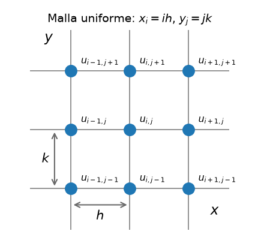

# Ecuaciones en Derivadas Parciales (EDP)

Hasta aquí las incógnitas dependían de una sola variable ($y(x)$). Cuando la incógnita depende de **dos o más variables** — posición y tiempo, o varias coordenadas espaciales — las derivadas son parciales y hablamos de **ecuaciones en derivadas parciales (EDP)**.

## Clasificación de las EDP lineales de segundo orden

La EDP lineal de segundo orden más general en dos variables es

$$A\,u_{xx} + B\,u_{xy} + C\,u_{yy} + P\,u_x + Q\,u_y + F\,u = G$$

Su tipo lo decide el **discriminante** $B^2 - 4AC$, igual que la ecuación cuadrática:

| Discriminante | Tipo | EDP canónica | Ejemplo físico | Datos necesarios |
| --- | --- | --- | --- | --- |
| $B^2 - 4AC < 0$ | **Elíptica** | Laplace: $u_{xx} + u_{yy} = 0$ | Temperatura de equilibrio en una placa, potencial eléctrico | Condiciones de contorno en *todo* el borde |
| $B^2 - 4AC = 0$ | **Parabólica** | Difusión: $u_t = D\,u_{xx}$ | Calor difundiéndose en una barra, difusión de contaminante | Condición inicial + contorno en $x$ |
| $B^2 - 4AC > 0$ | **Hiperbólica** | Ondas: $u_{tt} = c^2 u_{xx}$ | Cuerda vibrante, propagación de ondas | Dos condiciones iniciales ($u$ y $u_t$) + contorno |

*Comprobación:* para Laplace, $A = C = 1$, $B = 0$ → $-4 < 0$; para difusión ($A = 1$ en $x$, $C = 0$ en $t$) → $0$; para ondas ($A = 1$, $C = -c^2$) → $4c^2 > 0$.

## Conexión con lo que ya sabemos

La clasificación no es solo taxonomía, **determina la estrategia numérica**.

* **Elípticas** ≈ **PVF**: la información está en los bordes, todas las incógnitas se resuelven a la vez como un sistema global (el MDF de [PVF](05-PVF.md), ahora en malla 2D). Lo vemos en [EDP elípticas](08-Elipticas.md).
* **Parabólicas e hiperbólicas** ≈ **PVI en el tiempo + PVF en el espacio**: se discretiza el espacio con diferencias finitas y se marcha en $t$ con esquemas de Euler o similares. La estabilidad del paso temporal vuelve a ser el tema central ([Estabilidad](03-Estabilidad.md)). Lo vemos en [Parabólicas](09-Parabolicas.md).

## Discretización y notación

En los capítulos siguientes la idea es siempre la misma, el continuo se reemplaza por una **malla** de puntos y la EDP por una ecuación algebraica en cada nodo.

* **Malla:** nodos equiespaciados — $x_i = i\,h$ en el espacio; la segunda dirección es $t_j = j\,k$ en las parabólicas y $y_j = j\,h$ en las elípticas (malla cuadrada).
* **Incógnitas:** $u_{i,j}$ es el valor *calculado* por el esquema en el nodo. Escribimos $u_{i,j} \approx u(x_i, t_j)$ — o $u(x_i, y_j)$ en elípticas — con $\approx$, no $=$, porque difiere de la solución exacta en el error de truncamiento del método.
* **Stencil:** cada ecuación discreta acopla un nodo con unos pocos vecinos; cuáles entran depende de la EDP — la cruz de cinco puntos de Laplace en [Elípticas](08-Elipticas.md), la terna de la capa temporal anterior en [Parabólicas](09-Parabolicas.md).

> **Mirando adelante.** En un esquema explícito típico para ondas, la condición **CFL** $c\,k/h\le1$ exige que una onda no recorra más de una celda espacial durante un paso temporal. No desarrollaremos aquí las EDP hiperbólicas.
