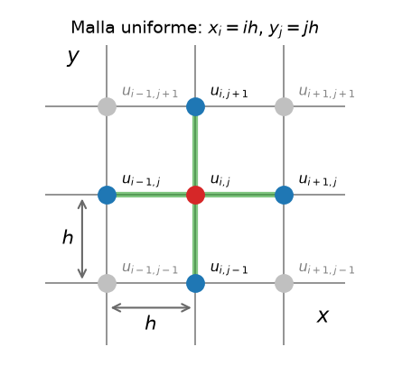
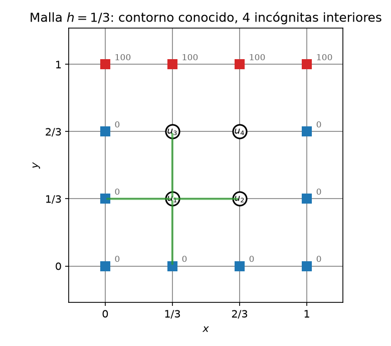
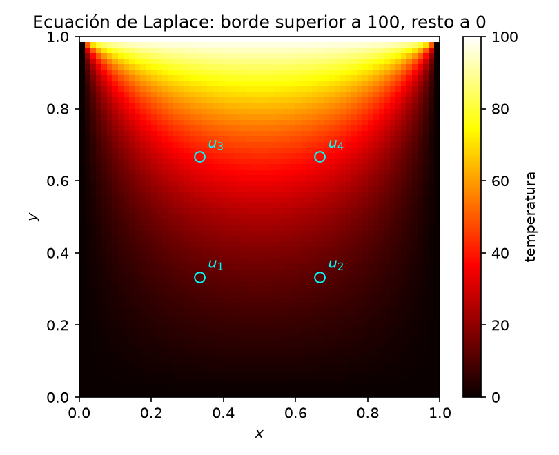

# EDP Elípticas: Ecuación de Laplace

La ecuación de Laplace

$$u_{xx} + u_{yy} = 0$$

describe estados de **equilibrio o estacionarios**, como por ejemplo la distribución de temperatura en una placa, el potencial eléctrico en una región del espacio sin cargas en su interior, el flujo ideal. En las EDP elípticas, la solución en cada punto interior está acoplada con *todos* los demás y no hay una dirección privilegiada en la que «marchar». Los datos llegan como condiciones de contorno sobre *todo* el borde. Es la generalización natural a dos dimensiones del [PVF por MDF](05-PVF.md).

---

## Discretización: el stencil de 5 puntos

Sobre una malla uniforme $x_i = i\,h$, $y_j = j\,h$, reemplazamos cada derivada segunda por la diferencia centrada $\mathcal{O}(h^2)$ de [PVF](05-PVF.md). Al patrón de nodos que interviene en cada punto (la cruz de la figura) se lo llama **stencil** («plantilla») y es el mismo en todos los nodos interiores.

{width=50%}

La versión discreta de la ecuación de Laplace $$u_{xx} + u_{yy} = 0$$ se obtiene al usar la aproximación de segunda derivada por diferencia centrada para ambas derivadas parciales:

$$\frac{{\color{#1f77b4}u_{i+1,j}} - 2{\color{#d62728}u_{i,j}} + {\color{#1f77b4}u_{i-1,j}}}{h^2} + \frac{{\color{#1f77b4}u_{i,j+1}} - 2{\color{#d62728}u_{i,j}} + {\color{#1f77b4}u_{i,j-1}}}{h^2} = 0$$

Despejando el punto central:

$$\boxed{{\color{#d62728}u_{i,j}} = \frac{{\color{#1f77b4}u_{i+1,j}} + {\color{#1f77b4}u_{i-1,j}} + {\color{#1f77b4}u_{i,j+1}} + {\color{#1f77b4}u_{i,j-1}}}{4}}$$

**Cada valor interior es el promedio de sus cuatro vecinos** — la versión discreta de la propiedad del valor medio de las funciones armónicas.

A partir de aquí el procedimiento es siempre el mismo, escribimos esta ecuación **en cada nodo interior** y obtenemos un sistema lineal con una ecuación por incógnita. Los vecinos que caen en el borde aportan su valor conocido, dado por las condiciones de contorno. El sistema se resuelve directamente o por iteración, como muestra el ejemplo siguiente.

---

## Ejemplo guía: placa con temperatura fija en los bordes

Placa cuadrada $[0,1] \times [0,1]$ con condiciones de Dirichlet, borde superior a $100$, los otros tres a $0$. Con $h = 1/3$ quedan **4 nodos interiores**:

Aplicando el stencil en cada nodo (los vecinos en el borde ya son conocidos):

* $u_1$: vecinos $0,\; u_2,\; u_3,\; 0$ → $4u_1 - u_2 - u_3 + 0u_4 = 0$
* $u_2$: vecinos $u_1,\; 0,\; u_4,\; 0$ → $-u_1 + 4u_2 + 0u_3 - u_4 = 0$
* $u_3$: vecinos $0,\; u_4,\; 100,\; u_1$ → $-u_1 + 0u_2 + 4u_3 - u_4 = 100$
* $u_4$: vecinos $u_3,\; 0,\; 100,\; u_2$ → $0u_1 - u_2 - u_3 + 4u_4 = 100$

---

## Resolución 1: método directo

En forma matricial $A\mathbf{u} = \mathbf{b}$:

$$\begin{bmatrix} 4 & -1 & -1 & 0 \\ -1 & 4 & 0 & -1 \\ -1 & 0 & 4 & -1 \\ 0 & -1 & -1 & 4 \end{bmatrix} \begin{bmatrix} u_1 \\ u_2 \\ u_3 \\ u_4 \end{bmatrix} = \begin{bmatrix} 0 \\ 0 \\ 100 \\ 100 \end{bmatrix}$$

La matriz es simétrica definida positiva y de diagonal dominante — estricta en este ejemplo, solo débil en mallas más finas — patrón general del stencil de 5 puntos. Resolviendo (por ejemplo, eliminación de Gauss, aprovechando la simetría izquierda–derecha $u_1 = u_2$, $u_3 = u_4$):

$$u_1 = u_2 = \mathbf{12.5}, \qquad u_3 = u_4 = \mathbf{37.5}$$

Los nodos junto al borde caliente quedan más calientes, como exige la física.

El método directo resuelve exactamente el sistema discreto (no la EDP continua). Una eliminación densa cuesta $\mathcal{O}(M^3)$ para $M$ incógnitas y desperdicia la estructura dispersa; una malla $100\times100$ ya produce cerca de $10^4$ incógnitas.

---

## Resolución 2: Gauss–Seidel

En lugar de resolver el sistema de golpe, iteramos. Barrido tras barrido, cada nodo se actualiza con el promedio de sus vecinos **usando siempre los valores más recientes**:

$$u_{i,j}^{(m+1)} = \frac{u_{i+1,j}^{(m)} + u_{i-1,j}^{(m+1)} + u_{i,j+1}^{(m)} + u_{i,j-1}^{(m+1)}}{4}$$

(es decir, vecinos aún no visitados en este barrido → valor antiguo $(m)$; ya visitados → valor nuevo $(m+1)$). Partiendo de $\mathbf{u}^{(0)} = \mathbf{0}$:

| Iteración | $u_1$ | $u_2$ | $u_3$ | $u_4$ |
| --- | --- | --- | --- | --- |
| 1 | 0.0000 | 0.0000 | 25.0000 | 31.2500 |
| 2 | 6.2500 | 9.3750 | 34.3750 | 35.9375 |
| 3 | 10.9375 | 11.7188 | 36.7188 | 37.1094 |
| 4 | 12.1094 | 12.3047 | 37.3047 | 37.4023 |
| 5 | 12.4023 | 12.4512 | 37.4512 | 37.4756 |
| 6 | 12.4756 | 12.4878 | 37.4878 | 37.4939 |
| $\to\infty$ | **12.5** | **12.5** | **37.5** | **37.5** |

Converge a la solución directa, como debe. El criterio de parada habitual es $\max_{i,j}|u^{(m+1)} - u^{(m)}| < \text{tol}$.

*Convergencia:* con condiciones de Dirichlet, la matriz del Laplaciano discreto (con el signo adoptado en el sistema) es simétrica definida positiva, lo que garantiza la convergencia de Gauss–Seidel. SOR acelera el barrido mediante $u^{(m+1)}=(1-\omega)u^{(m)}+\omega u^{(m+1)}_{\mathrm{GS}}$; el valor óptimo de $\omega$ depende de la malla.

> **Comprueba tu comprensión.** Calcula la iteración 7 a partir de la fila 6 y verifica que todos los valores están a menos de $0.02$ de la solución exacta.

---

## Más allá del ejemplo

* **Mallas finas:** con $N$ nodos interiores por lado, $A$ es de banda y muy dispersa (5 no nulos por fila); los métodos iterativos (Gauss–Seidel, SOR, gradiente conjugado) superan al directo tanto en memoria como en tiempo.
* **Neumann/Robin:** si un borde fija flujo en lugar de temperatura, el valor en el borde pasa a ser incógnita y se usa el nodo fantasma de [Condiciones de contorno](04-CondicionesContorno.md).
* **Poisson:** con fuente de calor interna, $u_{xx} + u_{yy} = f(x,y)$, solo cambia el lado derecho: $u_{i,j} = \tfrac{1}{4}(\text{vecinos}) - \tfrac{h^2}{4}f_{i,j}$.
