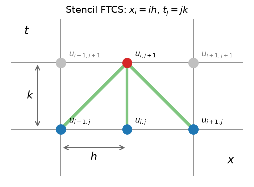
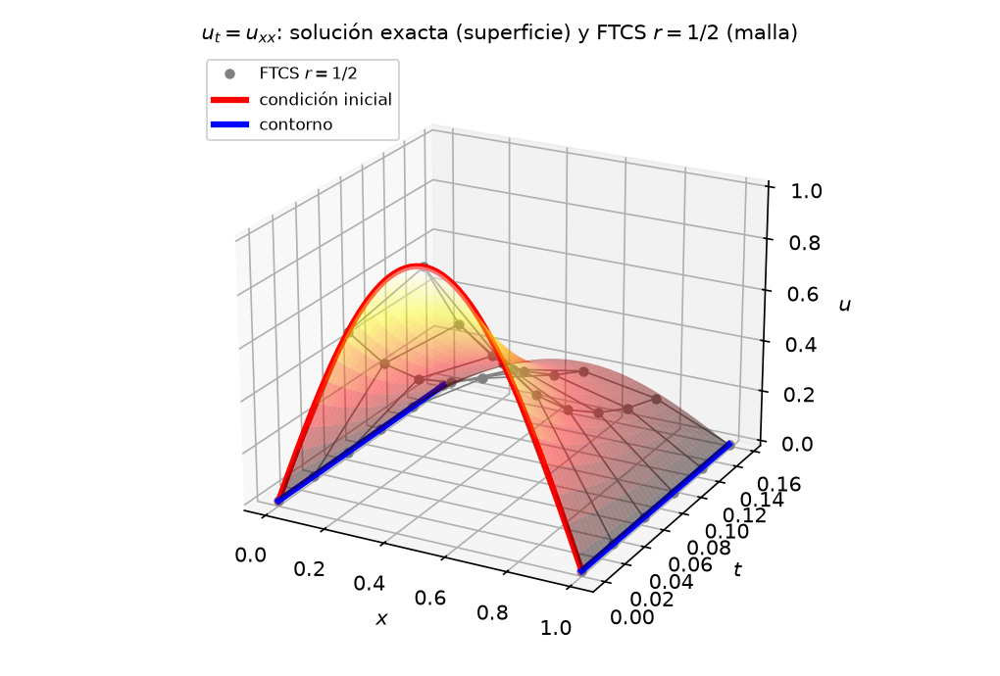
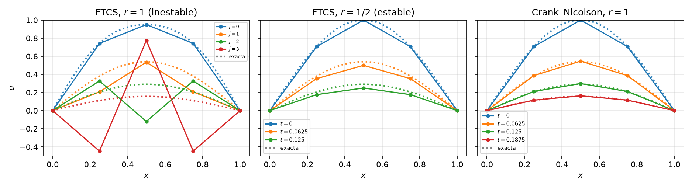
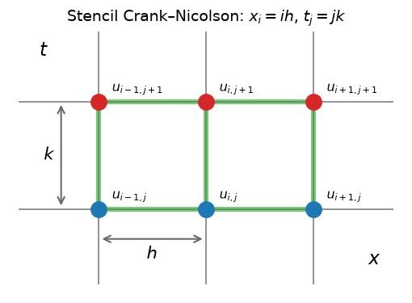
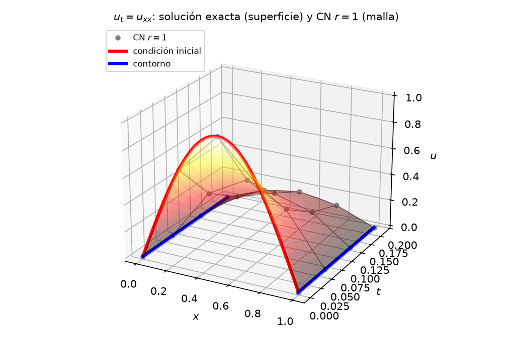

# EDP Parabólicas: Ecuación de Difusión

Las **EDP parabólicas** describen fenómenos que **evolucionan en una dirección privilegiada** (generalmente el tiempo) a partir de una condición inicial, con condiciones de contorno en el espacio. Su ejemplo canónico es la ecuación de difusión.

$$u_t = D\,u_{xx}, \quad x \in [0, 1],\; t > 0$$

Esta ecuación lleva una distribución inicial $u(x, 0)$ hacia el equilibrio. El estado final es la solución de la elíptica asociada ($u_{xx} = 0$, una recta entre las temperaturas de los extremos). El calor es solo el ejemplo físico habitual, la misma ecuación modela la difusión de un contaminante o el transporte de momento por viscosidad. Numéricamente combina los dos mundos de los capítulos anteriores, **diferencias finitas en el espacio** (como en [PVF](05-PVF.md)) + **marcha en el tiempo** (como en [PVI](01-PVI.md)).

Notación: $h$ = paso espacial, $k$ = paso temporal, $u_{i,j} \approx u(x_i, t_j)$ — convención de [EDP](07-EDP.md); aquí $j$ recorre el *tiempo*, no una segunda dirección espacial como en [Elípticas](08-Elipticas.md).

---

## Esquema explícito FTCS

Discretizando $u_{xx}$ con la diferencia centrada $\mathcal{O}(h^2)$ y $u_t$ con Euler hacia adelante $\mathcal{O}(k)$ se obtiene el esquema FTCS (*Forward Time, Centered Space*):

$$\frac{u_{i,j+1} - u_{i,j}}{k} = D\,\frac{u_{i+1,j} - 2u_{i,j} + u_{i-1,j}}{h^2}$$

Definiendo el **número de malla** $r = D\,k/h^2$, la actualización es explícita y local:

$${\color{#d62728}u_{i,j+1}} = {\color{#1f77b4}u_{i,j}} + r\,\left({\color{#1f77b4}u_{i+1,j}} - 2{\color{#1f77b4}u_{i,j}} + {\color{#1f77b4}u_{i-1,j}}\right)$$

La evolución es una marcha por capas temporales — el mismo «paso a paso» de Euler en [PVI](01-PVI.md):

* La **condición inicial** llena la capa $j = 0$ y todos los $u_{i,0} = u(x_i, 0)$ son conocidos.
* La fórmula produce la capa $j + 1$. Cada $u_{i,j+1}$ se calcula sólo con los tres valores de la capa $j$, el propio nodo y sus dos vecinos.
* En los extremos no se aplica la fórmula ya que las **condiciones de contorno** fijan su valor en cada capa.
* Precisión $\mathcal{O}(k + h^2)$ — primer orden en el tiempo, segundo en el espacio.

### Ejemplo guía

Resolver

$$u_t = u_{xx}$$

con condición inicial $u(x,0) = \sin(\pi x)$ y condiciones de contorno $u(0,t) = u(1,t) = 0$.

Sobre la malla $(x, t)$ con $h = 0.25$ y $k = 0.03125$ (es decir, $r = k/h^2 = 1/2$), el esquema solo recibe **datos en los bordes** y calcula todo lo demás:

* La **fila $j = 0$ (condición inicial)** es conocida por completo — $u_{i,0} = \sin(\pi x_i)$, es decir $(0,\; 0.7071,\; 1,\; 0.7071,\; 0)$.
* Las **columnas $i = 0$ e $i = 4$ (contorno)** valen $u_{0,j} = u_{4,j} = 0$ en todos los niveles.
* En el **interior**, cada $u_{i,j+1}$ se calcula con la terna $u_{i-1,j},\; u_{i,j},\; u_{i+1,j}$ del nivel anterior — la malla se rellena fila por fila, hacia tiempos crecientes.

La solución exacta $u(x,t) = e^{-\pi^2 t}\sin(\pi x)$ — una joroba que decae sin cambiar de forma — sirve de referencia para comparar lo que produce cada esquema.

### Estabilidad: la condición $r \le \tfrac{1}{2}$

El esquema FTCS es **condicionalmente estable**. El número de malla $r = D\,k/h^2$ de la actualización debe cumplir

$$\boxed{r \le \frac{1}{2}}$$

Es la misma idea que el límite $h < 2/\lambda$ de Euler en [Estabilidad](03-Estabilidad.md), ahora aplicada a cada modo espacial de la discretización. Los modos de alta frecuencia en $x$ (los «dientes de sierra» entre nodos vecinos) son los que divergen primero. En la práctica esto obliga a $k$ del orden de $h^2$. Hay que recordar que refinar la malla espacial a la mitad cuadruplica el número de pasos temporales.

La figura siguiente muestra el ejemplo guía en tres escenarios:

* **Izquierda — $r = 1$** ($k = 0.0625$, el doble del límite). En la figura se suma $0.05\sin(3\pi x)$ a la condición inicial para hacer visible lo que el redondeo introduce siempre. Ese modo crece un factor $\approx -2.4$ por paso — cambia de signo y más que duplica su amplitud — hasta dominar una solución que debería *decaer*. Oscilaciones crecientes y valores negativos son la firma de la inestabilidad.
* **Centro — $r = 1/2$** ($k = 0.03125$). La actualización se simplifica a $u_{i,j+1}=\tfrac12(u_{i+1,j}+u_{i-1,j})$. Es estable en el límite, pero el modo alternante queda sin amortiguar y el error aún es visible (~10 %). Conviene usar $r<1/2$ o un método temporal de mayor orden.
* **Derecha — Crank–Nicolson con $r = 1$.** El mismo paso que hace diverger a FTCS, resuelto de forma estable y más precisa por el método implícito de la sección siguiente.

---

## Método de Crank–Nicolson (CN)

El defecto de FTCS está en el tiempo. Euler adelante es solo $\mathcal{O}(k)$. Crank–Nicolson evalúa la derivada espacial como **promedio del instante viejo y el nuevo** — la regla del trapecio en el tiempo.

$$\frac{u_{i,j+1} - u_{i,j}}{k} = \frac{D}{2}\left[\frac{u_{i+1,j} - 2u_{i,j} + u_{i-1,j}}{h^2} + \frac{u_{i+1,j+1} - 2u_{i,j+1} + u_{i-1,j+1}}{h^2}\right]$$

Reordenando, las incógnitas en $t_{j+1}$ quedan a la izquierda:

$$-\frac{r}{2}\,{\color{#d62728}u_{i-1,j+1}} + (1+r)\,{\color{#d62728}u_{i,j+1}} - \frac{r}{2}\,{\color{#d62728}u_{i+1,j+1}} = \frac{r}{2}\,{\color{#1f77b4}u_{i-1,j}} + (1-r)\,{\color{#1f77b4}u_{i,j}} + \frac{r}{2}\,{\color{#1f77b4}u_{i+1,j}}$$

El esquema es **implícito** porque cada ecuación acopla las tres incógnitas vecinas de la capa $j+1$ (las rojas de la fórmula). Ninguna se puede calcular por separado como en FTCS y hay que resolver **toda la fila junta**. No es, sin embargo, el sistema global como en el caso de las  [Elípticas](08-Elipticas.md) donde todas las incógnitas de la grilla se acoplaban de una vez. Aquí el sistema involucra solo **una capa temporal por paso** — se resuelve la fila $j+1$ y se marcha a la siguiente. Además es **tridiagonal** — cada ecuación solo toca los vecinos inmediatos, el mismo patrón local del MDF de [PVF](05-PVF.md) — y se resuelve de forma sencilla. A cambio se obtiene:

* **Estabilidad incondicional** — no existe una cota superior de $r$ para evitar divergencia. Sin embargo, valores grandes pueden producir oscilaciones no físicas en modos de alta frecuencia.

* **Precisión $\mathcal{O}(k^2 + h^2)$** — el paso temporal se elige por precisión, no por estabilidad.

### Ejemplo: Crank–Nicolson con $r = 1$

Retomamos el ejemplo guía

$$u_t = u_{xx}$$

con condición inicial $u(x,0) = \sin(\pi x)$ y condiciones de contorno $u(0,t) = u(1,t) = 0$. Lo resolvemos sobre la misma malla $h = 0.25$, con tres nodos interiores de valores iniciales $u_{1,0} = 0.7071$, $u_{2,0} = 1$, $u_{3,0} = 0.7071$, pero ahora con $k = 0.0625$. El paso que hacía diverger a FTCS. Para referencia, la solución exacta es $u(x,t) = e^{-\pi^2 t}\sin(\pi x)$.

Con $r = 1$ el lado derecho se reduce a $\tfrac{1}{2}(u_{i-1,j} + u_{i+1,j})$ y cada paso resuelve el sistema

$$\begin{bmatrix} 2 & -0.5 & 0 \\ -0.5 & 2 & -0.5 \\ 0 & -0.5 & 2 \end{bmatrix} \begin{bmatrix} u_{1,j+1} \\ u_{2,j+1} \\ u_{3,j+1} \end{bmatrix} = \frac{1}{2}\begin{bmatrix} u_{0,j} + u_{2,j} \\ u_{1,j} + u_{3,j} \\ u_{2,j} + u_{4,j} \end{bmatrix}$$

La matriz es **la misma en todos los pasos**. Cada fila es la ecuación de un nodo interior y los coeficientes $1+r$ en la diagonal y $-r/2$ en las adyacentes no dependen ni de la posición ni del instante. Se factoriza una vez y se reutiliza en todos los pasos. Lo que cambia es el lado derecho, que se arma con los valores conocidos de la capa $j$. Cuando un vecino cae en el borde su valor viene del contorno (aquí $u_{0,j} = u_{4,j} = 0$).

Tabla de Crank–Nicolson con los valores del nodo interior $u_2$ en diferentes tiempos:

| $t_j$ | $u_2$ (CN) | Exacta $u_2$ |
| --- | --- | --- |
| 0.0625 | 0.5469 | 0.5396 |
| 0.125 | 0.2991 | 0.2912 |
| 0.1875 | 0.1636 | 0.1572 |

La solución obtenida por Crank–Nicolson es estable donde FTCS explotó y encima más preciso que el FTCS *estable* (error ~1.5% vs ~10%) y con la mitad de pasos.

---

## Comparación

| Propiedad | FTCS (explícito) | Crank–Nicolson (implícito) |
| --- | --- | --- |
| Actualización | $u_{i,j+1}$ directo de vecinos en $t_j$ | Sistema tridiagonal por paso (Thomas, $\mathcal{O}(N)$) |
| Estabilidad | $r \le 1/2$ (condicional) | Incondicional; no siempre monótona |
| Precisión | $\mathcal{O}(k + h^2)$ | $\mathcal{O}(k^2 + h^2)$ |
| Coste por paso | $\mathcal{O}(N)$ aritmética pura | $\mathcal{O}(N)$ resolución de sistema |
| Análogo en EDO | Euler adelante | Regla trapezoidal implícita |

El patrón se repite, **explícito = actualización directa con límite de estabilidad; implícito = sistema por paso sin ese límite** — la misma conclusión de [Estabilidad](03-Estabilidad.md) para EDO rígidas. La difusión es intrínsecamente «rígida» en el espacio donde los modos de alta frecuencia decaen muy rápido ($e^{-D\beta^2 t}$) y son ellos los que fijan el techo $r \le 1/2$ del esquema explícito, aunque ya hayan desaparecido de la solución.

> **Comprueba tu comprensión.** Para $D = 1$ y $h = 0.1$, ¿cuál es el mayor $k$ permitido por FTCS? ¿Cuántos pasos hacen falta para llegar a $t = 0.1$ con FTCS y con CN a $k = 0.01$?
